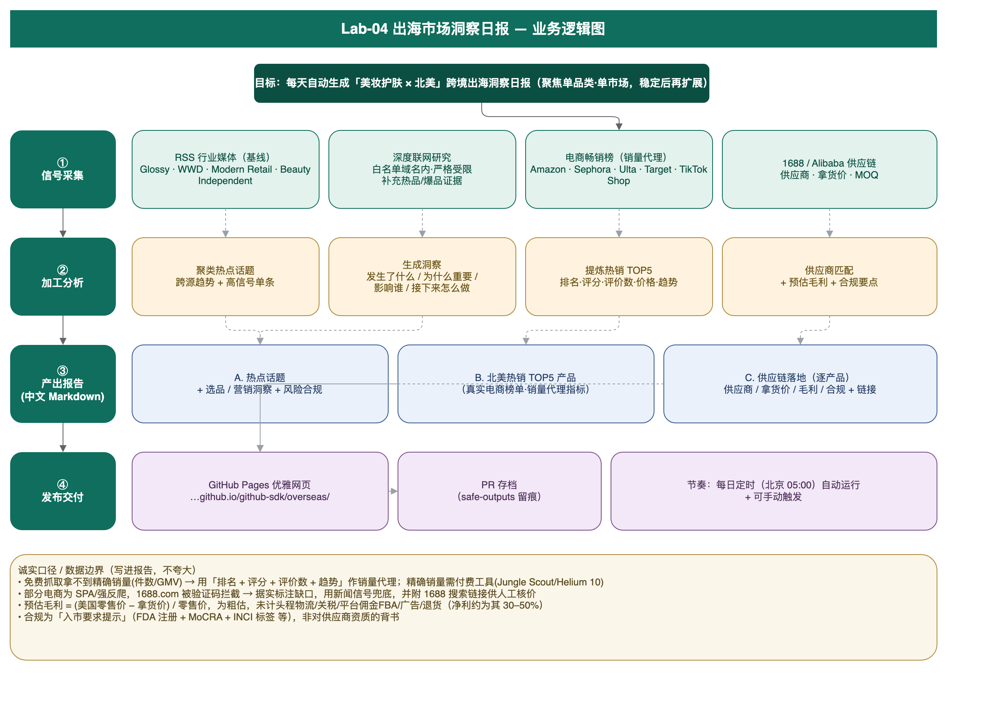
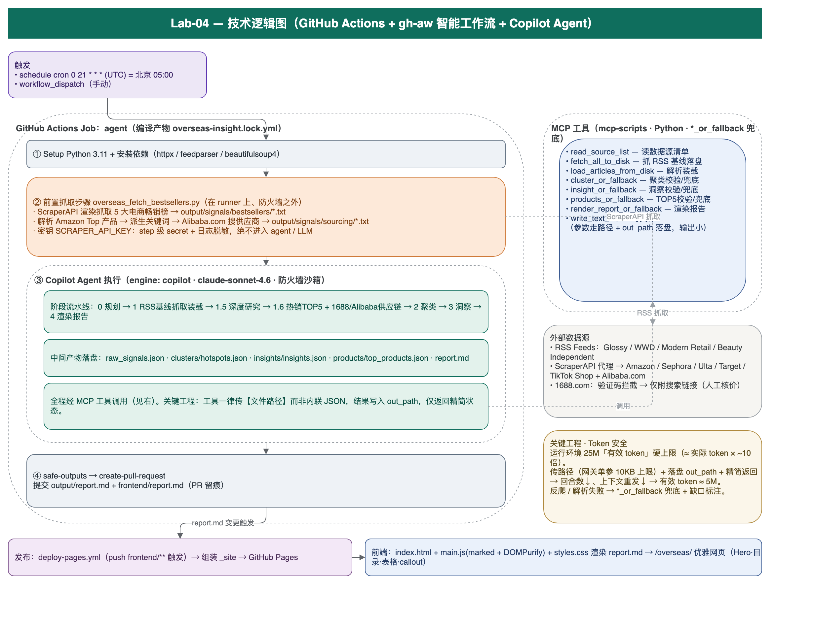

# Lab-04 逻辑图

两页 draw.io 图，梳理 Lab-04「出海市场洞察日报」的逻辑：

- **可编辑源文件**：[`lab-04-logic.drawio`](./lab-04-logic.drawio)（含两页：业务逻辑图 / 技术逻辑图）
  用 [diagrams.net](https://app.diagrams.net/) 打开，或在 VS Code 安装 **Draw.io Integration** 扩展直接编辑。

## 1. 业务逻辑图

「干什么」——从范围界定 → 信号采集 → 加工分析 → 产出报告 → 发布交付，以及贯穿全程的诚实数据口径。

## 2. 技术逻辑图

「怎么实现」——GitHub Actions + gh-aw 智能工作流 + Copilot Agent 的落地：触发、密钥隔离的前置抓取步骤、
Agent 阶段流水线、MCP 工具、外部数据源、Token 安全机制，以及 Pages 发布。

> PNG 由 `lab-04-logic.drawio` 经 diagrams.net 渲染导出；改图后从 draw.io 重新导出 PNG 即可保持同步。
